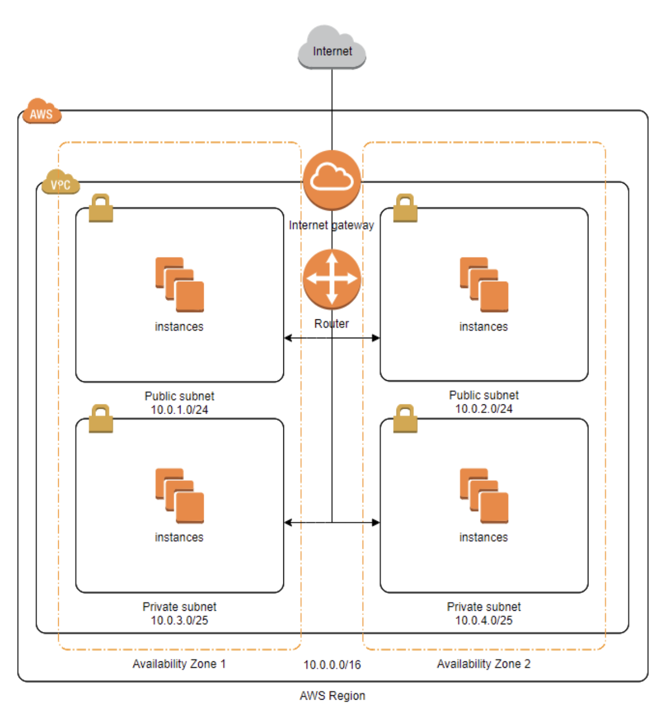

# 망 분리하기

## 들어가기에 앞서

- 네트워크를 왜 학습해야 할까요?
  - 서비스는 **네트워크**를 통해 사용자에게 **가치**를 전달한다. 따라서 네트워크 상의 이슈는 서비스에 심각한 문제를 발생시킬 수 있다. 안정적인 서비스 운영을 위해 미리 네트워크를 학습할 필요가 있다.

AWS 상에서 네트워크를 구성하며, 네트워크 기본 개념들을 학습한다.

## 1. 통신망

- 왜 망분리를 해야 하나요?
  - 개인 정보를 다루는 DB 서버 등을 위한 내부망, 사용자가 접근하는 웹 서버를 위한 외부망을 구성한다. (Defense in depth)

### 통신망

- 노드들과 이들 노드들을 연결하는 링크들로 구성된 하나의 시스템
- 노드란, IP로 식별할 수 있는 대상
- 링크란, 물리적 회선

즉, 하나의 Subnet을 하나의 망이라고 칭할 수 있다.

### AWS에서의 망

- Region: 국가 / 지역

- Availability Zone: 데이터센터

  - ap-northeast-2a
  - ap-northeast-2b

- VPC
  - 하나의 Region에 종속
  - 다수의 AZ 설정 가능
  - VPC IP 대역 내에서 망 구성
